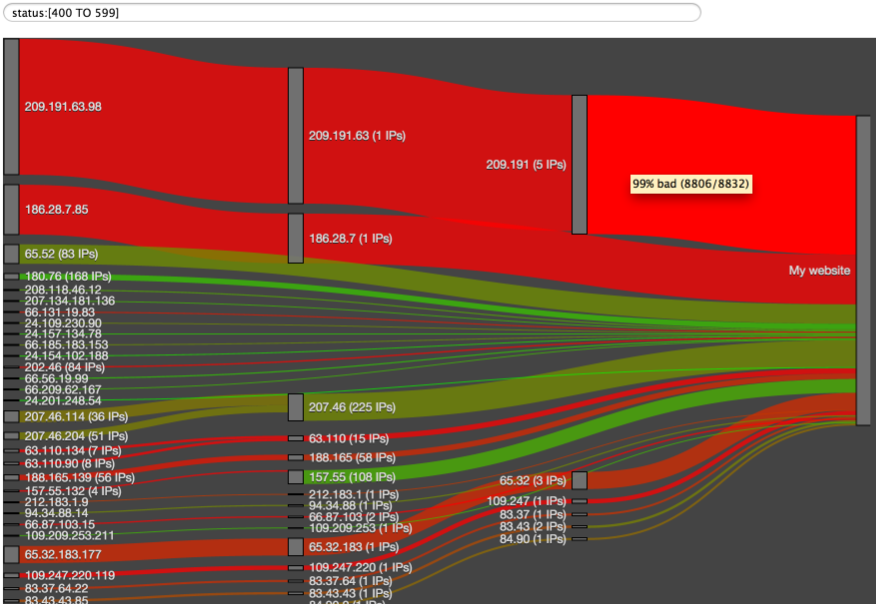

# netrisk
An elasticsearch site plugin for identifying risky IPs or subnets in web logs.

A webmaster can search for whatever risky web accesses look like (e.g. HTTP response status codes of 404) and the IP addresses or subnets with the highest concentrations of this type of traffic are identified.

Results are shown in a Sankey diagram and lines illustrate the flow of traffic through subnets. The colour of the lines ranges from red to green, representing the level of risk in traffic at that point. Webmasters can use this tool to decide on blocking an IP addres or an entire subnet

## Installation
To install netrisk onto your node, run bin/plugin -install markharwood/netrisk

Netrisk automatically connects to localhost, so it must be run on a node that is web-accessible. 

Netrisk has been tested on elasticsearch version 1.4+.

## Index setup
The plugin expects indexes to have a specific mapping configuration for IP addresses - the "exampleData" folder includes a minimal example and a shell script designed to create a "mylogs" index for testing.
Note that IP addresses are indexed with individual tokens for each subnet which can then be summarised in the diagram. The "remote_host" and "remote_host.subs" field names are hardcoded in the html but are easy to change if they don't meet your needs.

## Use
Once your index/indices are prepared open the tool using the URL http://localhost:9200/_plugin/netrisk/
Enter your choice of index names (commas and wildcards permitted, no spaces) and enter a Lucene query that vaguely represents "risky" behaviour. This might be HTTP response codes not in the normal range of 200 to 304 or requests with no User Agent specified. You don't need to be exact with the choice of query - we're are just looking for IPs or subnets that have more of a leaning to this behaviour than the standard well-behaved traffic with 200 status response codes. The query is executed and, all being well a diagram like the one above should appear.
Use the mouse scroll wheel to zoom and drag the blocks to rearrange the diagram. For full IP addresses on the left of the diagram there is a hyperlink to the "project honeypot" website to check for reports from other webmasters.

## Documentation
This plugin and the queries used behind the scenes are the subject of a forthcoming "log analytics" blog on the elasticsearch website. 
 
